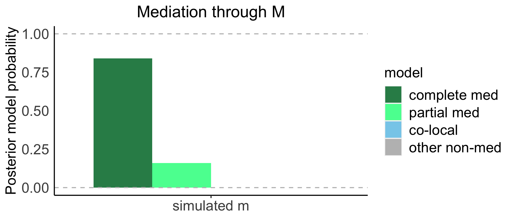
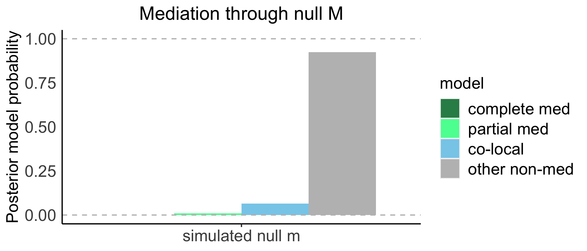
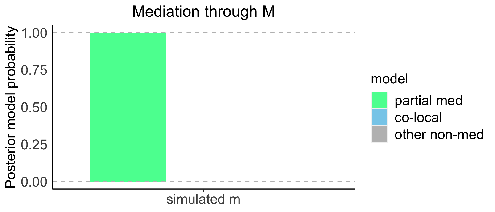
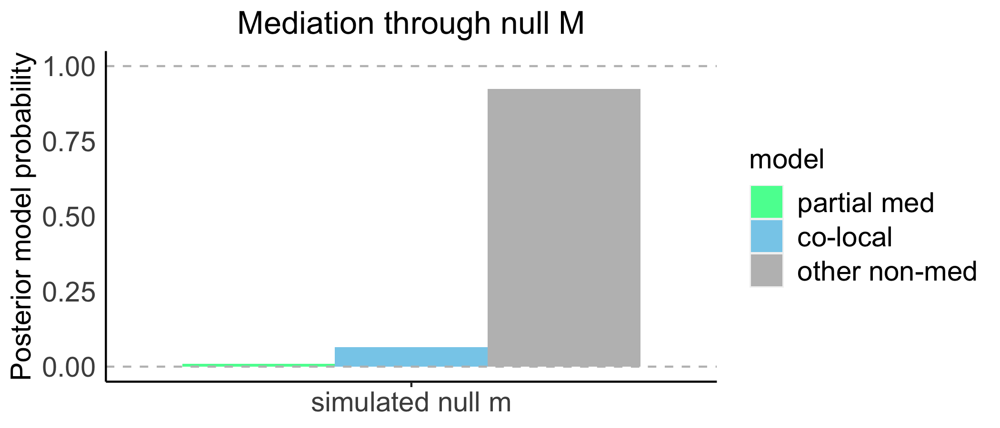

```{r setup, include = FALSE}
knitr::opts_chunk$set(
  collapse = TRUE,
  comment = "#>"
)
```


## Installing from Github and Loading the Package
```{r}
devtools::install_github("wesleycrouse/bmediatR", build_vignettes = T)
library(bmediatR)
library(ggplot2)
```

## Overview

bmediatR is an R package implementing a Bayesian model selection approach to mediation analysis. This simple vignette demonstrates how to get started using simulated Collaborative Cross (CC) data. bmediatR calculates the joint likelihood for an outcome `y` and candidate mediator `m` under 8 different hypotheses (see output below). Then, it combines the joint likelihoods with a prior probability over model options to calculate a posterior probability for 12 different models (see output below).

```{r}
model_info()
```


## Simulate Data
First, we will simulate a balanced design matrix with 20 observations of each founder allele, resulting in 160 CC strains.
```{r}
balanced_matrix <- sim_balanced_locus(founder_allele_reps = 20)
```

We will simulate data based on bi-allelic SNP evenly split between the founder strains
```{r}
# Matrix that maps eight founder alleles to two SNP alleles
M_single <- model_matrix_from_ID("0,0,0,0,1,1,1,1")
# SNP design matrix
SNP_X <-  balanced_matrix %*% M_single
```

```{r}
## Set seed so simulation is replicable
set.seed(10)
```

Simulate a mediator for which the SNP explains 70% of its variation:
```{r}
simple_m <- sim_mpp_single_locus(
  locus_matrix = balanced_matrix, 
  num_replicates = 1, 
  num_sim = 1,
  M_ID = "0,0,0,0,1,1,1,1", 
  impute = TRUE,
  strain_effect_size = 0,
  qtl_effect_size = 0.7 # SNP explains 70% of variation in mediator
)
```

Simulate a target for the mediator simulates 60% of its variation:
```{r}
simple_y <- sim_target_from_mediator(simple_m$data, mediator_effect_size = 0.6)
```

Simulate a null mediator (SNP has no effect):
```{r}
simple_m_null <- sim_mpp_single_locus(
  locus_matrix = balanced_matrix, 
  num_replicates = 1, 
  num_sim = 1,
  M_ID = "0,0,0,0,1,1,1,1", 
  impute = TRUE,
  strain_effect_size = 0,
  qtl_effect_size = 0, # SNP does not have an effect on mediator
  sim_label = "sim_m_null"
)
```

## Run Mediation Analysis

### Description of the main function
`bmediatR()` takes several arguments, but only three are required:

`y` is a named vector or single column matrix of an outcome variable.

```{r}
y <- simple_y$data[,1]
head(y)
```

`M` is a vector or matrix of mediators. To test multiple candidate mediators of an outcome, supply a matrix with the columns representing individual mediators.

```{r}
# Create matrix with multiple candidate mediators: the true and null simulated values
M <- cbind(simple_m$data[,1, drop = FALSE], simple_m_null$data[,1, drop = FALSE])
head(M)
```

`X` is the design matrix of the driver. In this example, `X` is a matrix encoding the genotype of the bi-allelic SNP.

```{r}
X <- SNP_X
head(X)
```

By default, `X` will be transformed with a sum-to-zero contrast on the columns. This is recommended when `X` has linearly dependent columns, as in the case of a bi-allelic SNP or haplotype contributions at a locus. If you are providing a single column matrix for `X` (such as sex or diet), you need to turn off this function by setting `options_X = list(sum_to_zero = FALSE, center = TRUE, scale = TRUE)`.

`bmediatR` can accommodate covariates for `y`, `M`, or both variables. A design matrix passed to `Z` will be used as a covariate for both `M` and `y`. It is possible to additionally supply a design matrix to `Z_y` for covariates that only apply to `y` and/or `Z_M` for those that only apply to `M`.

Prior specification for the effect size hyperparameter $\phi^2$ are passed as a vector to `phi_sq`. $\phi^2$ controls the prior effect size of each edge, relative to error, on `m` or `y`. By default, we set `phi_sq = c(1,1,1)` such that effect sizes for all edges are equal and relatively large *a priori*. `phi_sq` may also be calculated empirically, explained in the methods section of the [manuscript](https://www.biorxiv.org/content/10.1101/2021.07.19.452969v2).

`bmediatR` also allows for prior specification of log probabilities for each model, encoded in `ln_prior_c`. There are 12 possible models included in `bmediatR`, illustrated as directed acyclic graphs below.

```{r, fig.cap="**Fig 1. Models that may be included in bmediatR**. (a) Potential relationships between `X`, `Y`, and `M`, denoted by the vector theta. Models in (c) are included in the `partial` prior, models in (b & c) are included in the `complete` prior, and models in (b-d) are included in the `reactive` prior.", out.width="100%", echo = F}
knitr::include_graphics("fig1.png")
```

Users can either use one of the preset options for `ln_prior_c`, which place equal probability on all included models, or specify a particular probability for each model. The most commonly used preset option is `complete`, which assumes that `y` is downstream of `M (M -> y)`, and includes all possible edge combinations between X, M, and y. The `partial` setting only includes model options with the edge from `X -> y` present. Lastly, if it seems plausible that `M` could be reacting to `y (y -> M)`, use the `reactive` setting, which includes all possible combinations between `X`, `M`, and `y`. We caution users that there are a few caveats about claiming causality when using the `reactive` preset, which we describe in the manuscript. 

Use `return_ln_prior_c_from_presets()` to determine which models will be included based on the preset option. Models given a prior log probability of `0` will be included while those given `-Inf` will be excluded. The order of entries corresponds to the models represented by ML1-12 in **Fig 1**.
```{r}
return_ln_prior_c_from_presets("partial")
return_ln_prior_c_from_presets("complete")
return_ln_prior_c_from_presets("reactive")
```

Alternatively, users can provide their own prior model probabilities by passing a vector with an entry for each of the 12 models to `ln_prior_c`. If you want an equal probability placed on a desired set of models, provide a `0` for models you wish to include and `-Inf` for those you wish to exclude. If you want to down-weight or up-weight models (instead of equal model probabilities), use `ln_prior_c` to explicitly specify the desired probability of each model (on the log scale). Although we do not demonstrate an example, `ln_prior_c` may be calculated empirically, assuming most candidate mediators are not complete mediators of the outcome.

### Apply bmediatR to simulated data
Now, we will apply bmediatR to the true and null mediator, using the default effect size priors and selecting between `complete` model options.

```{r}
med_results <- bmediatR(
  y = y,
  M = M, 
  X = X,
  ln_prior_c = "complete",
  options_X = list(sum_to_zero = TRUE, center = FALSE, scale = FALSE)
)
```

The output of `bmediatR()` is a list:

```{r}
str(med_results)
```

`ln_prob_data` is a matrix with a row for each candidate mediator and columns containing the log likelihoods of each hypothesis described in `model_info()`. 

`ln_post_c` is a matrix with a row for each candidate mediator and columns containing the log posterior probability for each model described in `model_info()`.

`ln_post_odds` is a matrix with a row for each candidate mediator and columns containing the the log posterior odds for various model combinations.

`ln_prior_c` is a matrix with a single row encoding the prior log probabilities assigned to each model.

`ln_prior_odds` is a matrix containing prior log odds for various model combinations.

If we take a closer look at `ln_prob_data`, we see that some entries are `-Inf`:
```{r}
med_results$ln_prob_data
```
bmediatR only calculates the likelihood for hypotheses that are required based on the model options specified in `ln_prior_c`. Because we ran this with `ln_prior_c = complete`, we are excluding any models with reverse causality (`y -> m`), and thus likelihoods for $M$ with $y$ as a predictor (0,\*,- and 1,\*,-) do not need to be calculated.


We can plot the results of bmediatR using the `plot_posterior_bar()` function:
```{r, echo = F, include=FALSE}
ggsave("true_med_fig.png",
       plot_posterior_bar(med_results, mediator_id = "sim_m_1",
                          relabel_x = "simulated m", main = "Mediation through M") ,
       width = 7, height = 3
)
ggsave("null_med_fig.png",
       plot_posterior_bar(med_results, mediator_id = "sim_m_null_1",
                          relabel_x = "simulated null m", main = "Mediation through null M"),
       width = 7, height = 3
)
```


```{r,  eval = F}
plot_posterior_bar(med_results, mediator_id = "sim_m_1", 
                   relabel_x = "simulated m", main = "Mediation through M") 
```

```{r,  out.width="100%", echo = F}

```

```{r,  eval = F}
plot_posterior_bar(med_results, mediator_id = "sim_m_null_1", 
                   relabel_x = "simulated null m", main = "Mediation through null M")
```


```{r,  out.width="100%", echo = F}

```

bmediatR accurately places the greatest posterior probability on the complete mediation model and other non-mediation models when testing the simulated mediator and null mediator, respectively. 

### Re-calculating posterior probabilities

The most computationally expensive portion of the method is calculating the likelihood of each hypothesis. Once that step has been completed, it is simple to calculate the posterior probability of each model using the prior distribution over model options. Thus, we built a function that allows users to re-calculate posterior model probabilities using a bmediatR object and updated prior model distribution. 


#### Using preset prior options

Let's re-run bmediatR on the simulated data, but only include models containing a direct edge from `X` to `y`:

```{r}
med_results_updated <- posterior_summary(
  ln_prob_data = med_results$ln_prob_data, 
  ln_prior_c = "partial", 
  c_numerator = return_preset_odds_index()
)
str(med_results_updated)
```

The output contains the same elements as the `bmediatR()` function, without the likelihoods because they are not altered by changing the prior model probabilities. 

Plotting these results reveals that the true mediator is now classified as a partial mediator because complete mediation is not a model option:

```{r, echo = F, include=FALSE}
ggsave("true_med_fig_update.png",
       plot_posterior_bar(med_results_updated, mediator_id = "sim_m_1",
                          relabel_x = "simulated m", main = "Mediation through M") ,
       width = 7, height = 3
)
ggsave("null_med_fig_update.png",
       plot_posterior_bar(med_results_updated, mediator_id = "sim_m_null_1",
                          relabel_x = "simulated null m", main = "Mediation through null M"),
       width = 7, height = 3
)
```


```{r,  eval = F}
plot_posterior_bar(med_results_updated, mediator_id = "sim_m_1", 
                   relabel_x = "simulated m", main = "Mediation through M") 
```

```{r,  out.width="100%", echo = F}

```

```{r,  eval = F}
plot_posterior_bar(med_results_updated, mediator_id = "sim_m_null_1", 
                   relabel_x = "simulated null m", main = "Mediation through null M")
```


```{r,  out.width="100%", echo = F}

```

There are limitations of this function, as the required likelihoods must have been calculated in the original bmediatR object. For example, if we recalculate using `ln_prior_c = reactive`, the posterior probabilities for models with reverse causality will not be calculated because we did not calculate the likelihood for the hypotheses with reverse causality in the original function call.
```{r}
med_results_updated_reactive <- posterior_summary(
  ln_prob_data = med_results$ln_prob_data, 
  ln_prior_c = "reactive", 
  c_numerator = return_preset_odds_index()
)

med_results_updated_reactive$ln_post_c
```

<!-- #### Using user-specified prior -->

<!-- Alternatively, the user can re-weight prior model probabilities as desired. Suppose that the complete mediation model is unlikely. We can down weight it by assigning a lower probability. Under the default `complete` prior, the complete mediation model receives a prior probability of $\frac18 = 0.125$. In this case, we will assign it a probability of $0.01$, and distribute the remaining probability equally over the other 7 models.  -->

<!-- ```{r} -->
<!-- # Start with a prior probability of zero for each model -->
<!-- ln_prior_c <- rep(0, 12) -->
<!-- ln_prior_c[1:8] <- (1 - 0.01)/7 -->
<!-- ln_prior_c[return_preset_odds_index()$complete] <- 0.01 -->
<!-- ln_prior_c -->
<!-- sum(ln_prior_c) -->

<!-- # now we need to take the log of the prior -->
<!-- ln_prior_c <- log(ln_prior_c) -->

<!-- med_results_updated_2 <- posterior_summary( -->
<!--   ln_prob_data = med_results$ln_prob_data,  -->
<!--   ln_prior_c = ln_prior_c, -->
<!--   c_numerator = return_preset_odds_index() -->
<!-- ) -->

<!-- plot_posterior_bar(med_results_updated_2, mediator_id = "sim_m_1",  -->
<!--                    relabel_x = "simulated m", main = "Mediation through M")  -->

<!-- ``` -->

<!-- With the updated prior, the complete mediation model now has a lower posterior probability than the partial mediation model. -->