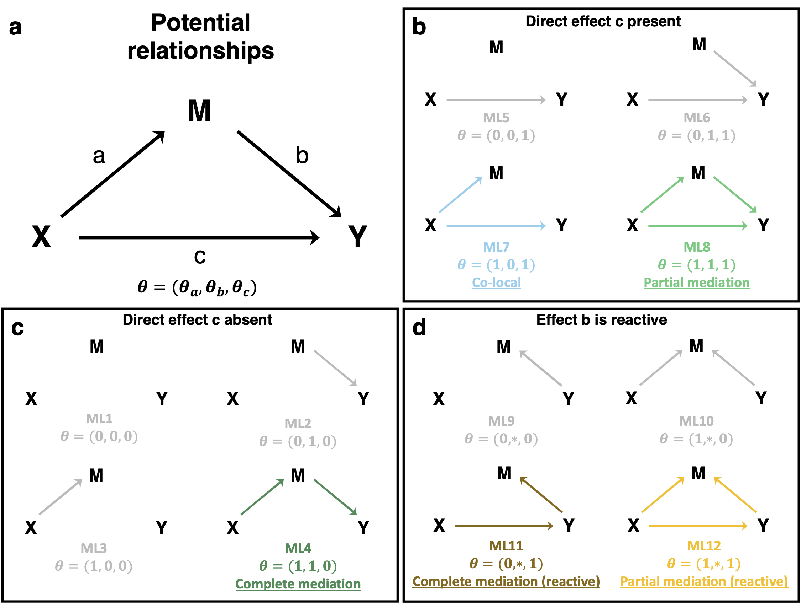

```{r setup, include = FALSE}
knitr::opts_chunk$set(
  collapse = TRUE,
  comment = "#>"
)
```

# Overview

bmediatR is an R package implementing a Bayesian model selection approach to mediation analysis. This simple vignette demonstrates how to get started using simulated Collaborative Cross (CC) mouse data. 

# Installing from Github and Loading the Package
```{r, message=FALSE}
devtools::install_github("wesleycrouse/bmediatR@add-vignettes", build_vignettes = T)
library(bmediatR)
library(tidyverse)
```

# Summary of the Method

We have developed a flexible and general approach to mediation analysis based on Bayesian model selection aimed at uncovering the relationship between a dependent variable (`X`), outcome (`Y`), and candidate mediator (`M`). Our approach incorporates prior information about the likelihood of each potential relationship (causal model) and the strength of causal effects between `X`, `Y`, and `M`. It can also accommodate multiple genetic variants or multi-state haplotypes.

In our framework, there are three possible edges between the variables: `X -> M`, `M -> Y`, and `X -> Y` (**Fig 1a**). We label them *a*, *b*, and *c*, respectively, and we define each edge to be absent or present with an indicator vector $\pmb\theta = (\theta_a, \theta_b, \theta_c)$. For example, complete mediation is denoted by $\pmb\theta = (1, 1, 0)$ and partial mediation is denoted by $\pmb\theta = (1,1,1)$. This leads to 8 possible combinations of edges, each defining a different causal model (**Fig 1 b&c**). In addition, we consider four additional models featuring reverse causality, in which the direction of edge *b* is reversed so that `M` is reacting to `Y` (**Fig 1d**). In these models, we indicate that edge *b* is reactive with (\*). Thus, there are 12 causal models that may describe the relationship between `X`, `Y`, and `M` and can be included in our method. 

```{r, fig.cap="**Fig 1. Models that may be included in bmediatR**. (a) Potential relationships between `X`, `Y`, and `M`, denoted by the vector theta. (b) Causal models with the direct edge from `X` to `Y` present. (c) Causal model with no direct edge from `X` to `Y`. (d) Causal models with reverse causality from `Y` to `M`.", out.width="100%", echo = F}

```

For each of these 12 models, bmediatR calculates the conditional joint likelihood for `Y` and `M` using the closed form solution described in the [manuscript](https://www.biorxiv.org/content/10.1101/2021.07.19.452969v2). The package includes a function that describes each calculated likelihood (H1-H8) and the combinations of likelihoods for `Y` and `M` that contribute to each causal model (c1-c12).

```{r}
model_info()
```

bmediatR combines the conditional likelihoods with prior model probabilities to output a posterior probability and posterior odds for each causal model. The package includes functions that make it easy for the user to customize bmediatR inferences (*ie.* which models to include in the analysis or which posterior odds to calculate), which we discuss at the end of this vignette. 

# Simulate Data

In this example, we will be using simulated data from 160 CC strains. We will start by simulating a balanced design matrix with 20 observations of each of the 8 founder alleles using the built-in functions for simulating data from a multi-parental population (MPP).
```{r}
# design matrix for founder alleles at locus
balanced_matrix <- sim_balanced_locus(founder_allele_reps = 20)
str(balanced_matrix)
```

We will simulate data based on bi-allelic SNP evenly split between the founder strains.
```{r}
# Matrix that maps eight founder alleles to two SNP alleles
M_single <- model_matrix_from_ID("0,0,0,0,1,1,1,1")
head(M_single)

# design matrix for SNP
SNP_X <-  balanced_matrix %*% M_single
head(SNP_X)
```


Next, we will simulate a mediator for which the SNP explains 70% of its variation and a target for which the mediator explains 60% of its variation. We will also simulate a null mediator that is not influenced by the SNP and is independent of the target.
```{r}
# Set seed so simulation is replicable
set.seed(10)

# Simulate mediator using balanced founder haplotype contributions and a bi-allelic SNP
simple_m <- sim_mpp_single_locus(
  locus_matrix = balanced_matrix,
  num_replicates = 1,
  num_sim = 1,
  M_ID = "0,0,0,0,1,1,1,1",
  impute = TRUE,
  strain_effect_size = 0,
  qtl_effect_size = 0.7 # SNP explains 70% of variation in mediator
)

# Simulate a target from the mediator with a 0.6 effect size
simple_y <- sim_target_from_mediator(simple_m$data, mediator_effect_size = 0.6)

# Simulate a null mediator that is independent of the SNP and target
simple_m_null <- sim_mpp_single_locus(
  locus_matrix = balanced_matrix,
  num_replicates = 1,
  num_sim = 1,
  M_ID = "0,0,0,0,1,1,1,1",
  impute = TRUE,
  strain_effect_size = 0,
  qtl_effect_size = 0, # SNP does not have an effect on mediator
  sim_label = "sim_m_null"
)
```

# Mediation Analysis with bmediatR

In this section, we will apply Baysian model selection to the simulated data using bmediatR.

## Data Formatting
`bmediatR()` takes several arguments, but only three are required:

`y` is a named vector or single column matrix of an outcome variable.

```{r}
y <- simple_y$data[,1]
head(y)
```

`M` is a vector or matrix of mediators. To test multiple candidate mediators of an outcome, supply a matrix with the columns representing individual mediators.

```{r}
# Create matrix with multiple candidate mediators: the true and null simulated values
M <- cbind(simple_m$data[,1, drop = FALSE], simple_m_null$data[,1, drop = FALSE])
head(M)
```

`X` is the design matrix of the driver. In this example, `X` is a matrix encoding the genotype of the bi-allelic SNP.

```{r}
X <- SNP_X
head(X)
```

By default, `X` will be transformed with a sum-to-zero contrast on the columns. This is recommended when `X` has linearly dependent columns, as in the case of a bi-allelic SNP or founder haplotype contributions at a genetic locus. If you are providing a single column matrix for `X` (*ie.* a continuous variable), you need to turn off this function by setting `options_X = list(sum_to_zero = FALSE, center = TRUE, scale = TRUE)`.

`bmediatR` can accommodate covariates for `y`, `M`, or both variables. A design matrix passed to `Z` will be used as a covariate for both `M` and `y`. Covariates that only apply to `y` or `M` can additionally be passed to `Z_y` or `Z_M`, respectively.

## Specifying priors

Prior specifications for the effect size hyperparameter $\phi^2$ are passed as a vector to `phi_sq`. $\phi^2$ controls the prior effect size of each edge, relative to error, on `m` or `y`. By default, we set `phi_sq = c(1,1,1)` such that effect sizes for all edges are equal and relatively large *a priori*. `phi_sq` may also be calculated empirically, explained in the methods section of the manuscript.

`bmediatR` also allows for prior specification of log probabilities for each model, encoded in `ln_prior_c`. As previously mentioned, there are 12 models included in bmediatR (**Fig 1**). Users can either use one of the preset options for `ln_prior_c`, which place equal probability on all included models, or specify a particular probability for each model. The most commonly used preset option is `complete`, which assumes that `y` is downstream of `M` `(M -> y)`, and includes all possible edge combinations between `X`, `M`, and `y` (DAGs in **Fig 1 b & c**). Alternatively, the `partial` setting is comparable to the Sobel test in that it only includes model options with a direct edge from `X -> y` (DAGs in **Fig 1 b**). Lastly, if it seems plausible that `M` could be reacting to `y` `(y -> M)`, use the `reactive` setting, which includes all 12 causal models (DAGs in **Fig 1 b-d**). We caution users that there are a few caveats about claiming causality when using the `reactive` preset, which we describe in the manuscript.

The `return_ln_prior_c_from_presets()` function details which models will be included based on the preset option. Models given a prior log probability of `0` will be included while those given `-Inf` will be excluded. The order of entries corresponds to the models represented by ML1-ML12 in **Fig 1** and c1-c12 in `model_info()`.
```{r}
return_ln_prior_c_from_presets("partial")
return_ln_prior_c_from_presets("complete")
return_ln_prior_c_from_presets("reactive")
```

Alternatively, users can provide their own prior model probabilities by passing a vector with an entry for each of the 12 models to `ln_prior_c`. If you want an equal probability placed on a desired set of models, provide a `0` for models you wish to include and `-Inf` for those you wish to exclude. If you want to down-weight or up-weight models (instead of equal model probabilities), use `ln_prior_c` to explicitly specify the desired probability of each model (on a log scale). Although we do not demonstrate an example, `ln_prior_c` may be calculated empirically with the assumption that most candidate mediators are not complete mediators of the outcome.

## Results of bmediatR
Now that we have simulated CC data and discussed the requirements for running bmediatR, we will test both the true and null mediators as candidate mediators of the outcome. In this example, we will use the default effect size priors and select between `complete` model options.

```{r}
med_results <- bmediatR(
  y = y,
  M = M,
  X = X,
  ln_prior_c = "complete",
  options_X = list(sum_to_zero = TRUE, center = FALSE, scale = FALSE)
)
```

The output of `bmediatR()` is a list:

```{r}
str(med_results)
```

`ln_prob_data` is a matrix with a row for each candidate mediator and columns containing the log likelihoods of H1-H8 described in `model_info()`. If we take a closer look at `ln_prob_data`, we see that some entries are `-Inf`:
```{r}
med_results$ln_prob_data
```

bmediatR only calculates the likelihood for hypotheses that are required based on the model options specified in `ln_prior_c`. Because we ran this analysis `ln_prior_c = complete`, we are excluding any models with reverse causality (`y -> m`), and thus likelihoods for `M` with `y` as a predictor (0,\*,- and 1,\*,-) do not need to be calculated.

`ln_post_c` is a matrix with a row for each candidate mediator and columns containing the log posterior probability for each causal model c1-c12 described in `model_info()`. Models that were given a prior probability of `-Inf` will also have a posterior probability of `-Inf`:

```{r}
med_results$ln_post_c
```

`ln_post_odds` is a matrix with a row for each candidate mediator and columns containing the the log posterior odds for various model combinations. Posterior odds are calculated with the following quantities in the numerator: `mediation` is the sum of partial and complete mediation models; `mediation_or_colocal` is the sum of partial mediation, complete mediation, and co-local models; `y_depends_x` is the sum of all models with a direct edge from `X` to `Y`; `y_depends_m` is the sum of all models with an edge from `M` to `Y`; and `reactive` sums all models with reverse causality. The `partial`, `complete`, and `colocal` odds only include the partial mediation, complete mediation, and co-local models in the numerator, respectively.

```{r}
med_results$ln_post_odds
```

`ln_prior_c` is a matrix with a single row encoding the prior log probabilities assigned to each model. In this case, the prior model probabilities are equal for all models without reverse causality:

```{r}
med_results$ln_prior_c
```

`ln_prior_odds` is a matrix containing prior log odds for the model combinations included in `ln_post_odds`.

```{r}
med_results$ln_prior_odds
```


We can plot the results of bmediatR using the `plot_posterior_bar()` function:

```{r}
plot_posterior_bar(med_results, mediator_id = "sim_m_1",
                   relabel_x = "simulated m", main = "Mediation through M",
                   add_number_labels = T, num_dig = 2)

plot_posterior_bar(med_results, mediator_id = "sim_m_null_1",
                   relabel_x = "simulated null m", main = "Mediation through null M",
                   add_number_labels = T, num_dig = 2)
```

bmediatR accurately places the greatest posterior probability on the complete mediation model and other non-mediation models when testing the complete mediator and null mediator, respectively. In our summary, we sum the probability of causal models that are not co-local, partial mediation, or complete mediation to create an "other non-mediation" category.

# Customizing posterior summary

We previously mentioned that bmediatR allows for flexible inferences and posterior summaries. The most computationally expensive portion of the method is calculating the likelihood of each hypothesis. Once that step has been completed, it is simple to calculate the posterior probability of each model using the prior distribution over model options. Thus, we built a function that allows users to re-calculate posterior model probabilities and odds using a bmediatR object and updated prior model distribution.

## Using preset prior options

Let's re-run bmediatR on the simulated data, but only include models containing a direct edge from `X` to `y`. `posterior_summary()` takes as input the log posterior likelihoods returned from `bmediatR()`, the updated prior model probabilities, and a list of indices of causal models to be summed in the numerator for posterior odds. The `return_preset_odds_index()` function returns the default list of indices used.

```{r}
# Show example of list specifying which posterior odds to be calculated
return_preset_odds_index()

# Update posterior probabilities with "partial" setting
med_results_updated <- posterior_summary(
  ln_prob_data = med_results$ln_prob_data,
  ln_prior_c = "partial",
  c_numerator = return_preset_odds_index()
)
str(med_results_updated)
```

The output contains the same elements as the `bmediatR()` function, without the likelihoods because they are not altered by changing the prior model probabilities.

Plotting these results reveals that the true mediator is now classified as a partial mediator because complete mediation is not a model option:

```{r}
plot_posterior_bar(med_results_updated, mediator_id = "sim_m_1",
                   relabel_x = "simulated m", main = "Mediation through M",
                   add_number_labels = T, num_dig = 2)

plot_posterior_bar(med_results_updated, mediator_id = "sim_m_null_1",
                   relabel_x = "simulated null m", main = "Mediation through null M",
                   add_number_labels = T, num_dig = 2)
```


There are limitations of this function, as the requisite likelihoods must have been calculated in the original call to `bmediatR()`. For example, if we recalculate using `ln_prior_c = reactive`, the posterior probabilities for models with reverse causality will remain `-Inf` because we did not calculate the likelihood for the hypotheses with reverse causality in the original function call.

```{r}
med_results_updated_reactive <- posterior_summary(
  ln_prob_data = med_results$ln_prob_data,
  ln_prior_c = "reactive",
  c_numerator = return_preset_odds_index()
)

med_results_updated_reactive$ln_post_c
```

## Using user-specified prior

Alternatively, the user can re-weight prior model probabilities as desired. Suppose that the complete mediation model is unlikely. We can down weight it by assigning a lower probability. Under the default `complete` prior, the complete mediation model receives a prior probability of $\frac18 = 0.125$. In this case, we will assign it a probability of $0.01$, and distribute the remaining probability equally over the other 7 models.

```{r}
# Start with a prior probability of zero for each model
ln_prior_c <- rep(0, 12)
ln_prior_c[1:8] <- (1 - 0.01)/7
# Assign complete mediation model a probability of 0.01
ln_prior_c[return_preset_odds_index()$complete] <- 0.01
ln_prior_c

# The sum of model probabilities needs to equal 1
sum(ln_prior_c)

# take the log of the prior
ln_prior_c <- log(ln_prior_c)

med_results_updated_custom <- posterior_summary(
  ln_prob_data = med_results$ln_prob_data,
  ln_prior_c = ln_prior_c,
  c_numerator = return_preset_odds_index()
)

plot_posterior_bar(med_results_updated_custom, mediator_id = "sim_m_1",
                   relabel_x = "simulated m", main = "Mediation through M",
                   add_number_labels = T, num_dig = 2)

```

With the updated prior, the partial mediation model now has the greatest posterior probability.
